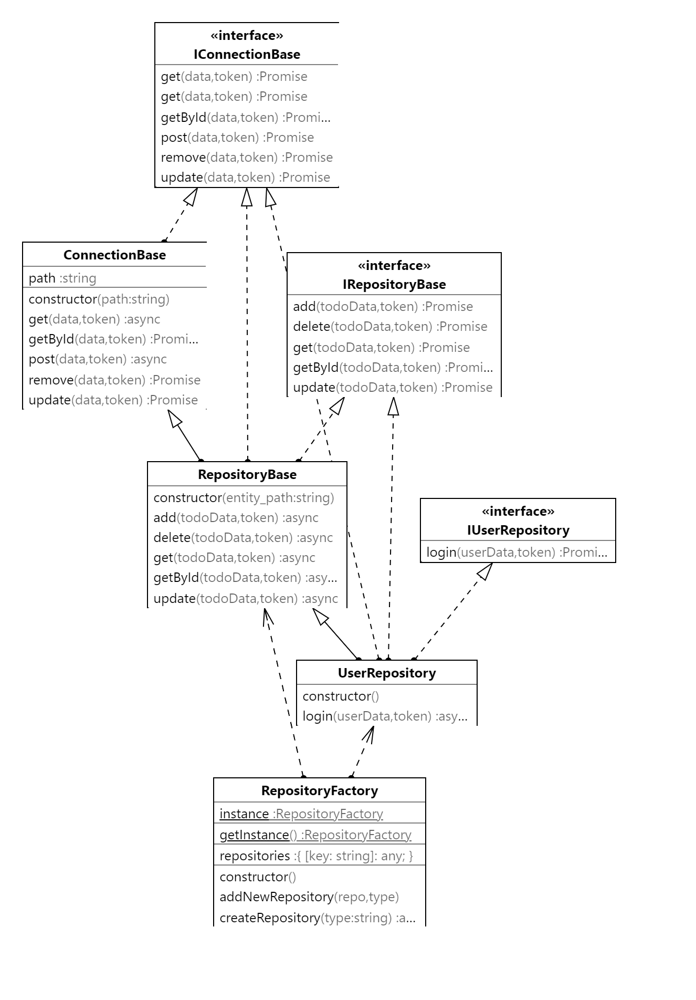
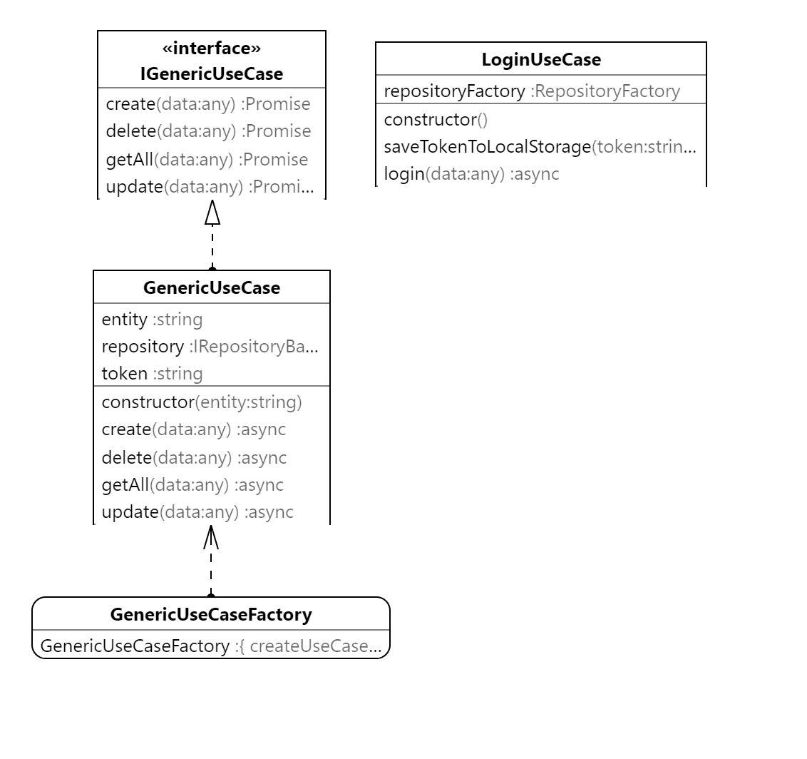
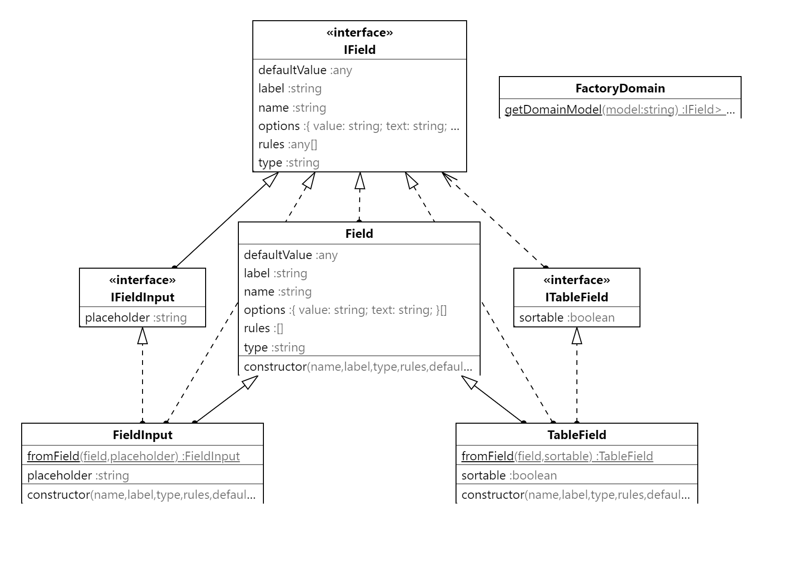

# Frontend Library


Este repositorio usa o seguinte backend:

https://github.com/felipefo/MiniApiDotNet

## Diagramas 


### Camada de acesso a api



### Camada de implementacao de casos de uso 


### Camada de reuso de elementos de interface 



## Project setup
```
npm install
```

### Compiles and hot-reloads for development
```
npm run serve
```

### Compiles and minifies for production
```
npm run build
```

### Lints and fixes files
```
npm run lint
```

### Customize configuration
See [Configuration Reference](https://cli.vuejs.org/config/).
